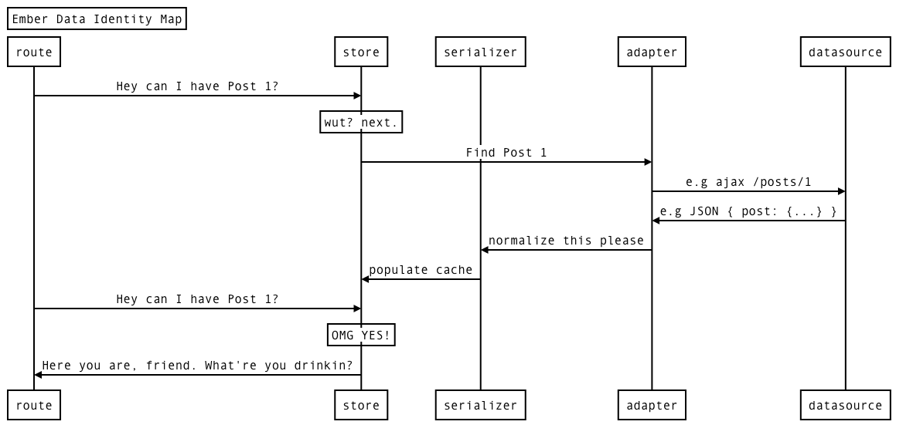
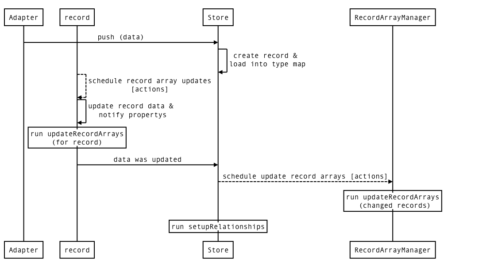
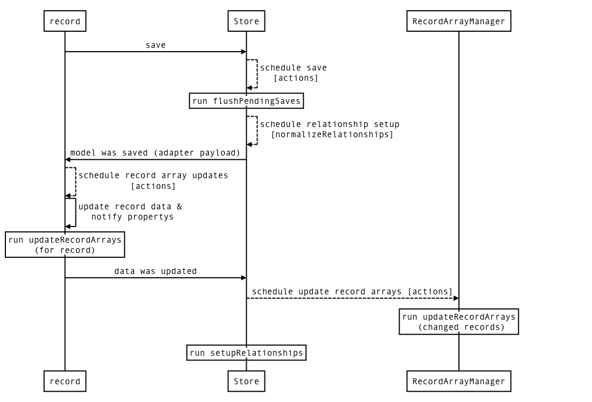
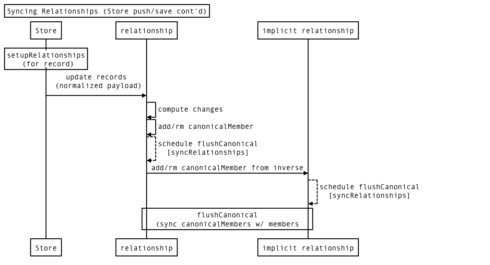

> Understanding Ember Data by Looking at Internals

---

> Ember Data is a library for robustly managing model data in your Ember.js applications.

^ But what I often hear from developers is more along the lines of

---

> Ember Data is magic

^ While I'm guily of this type of sentiment from time to time, it's a pet peeve of mine.

^ Instead I think what we mean is:

---

> Ember Data is ~~magic~~ operating at a level of abstraction I'm not comfortable with yet

---

> **Disclaimer**: Don't rely on private APIs if possible.

> This stuff *will* change.

^ That's nice, but how can we describe ember-data

^ Let's start by what it's not

---

# What It Isn't

* A relational database
* Rail's ActiveRecord
* The long sought after 1.0

^ No joins, no foreign keys, query language

^ Despite sharing core team members, overlapping audience, it is NOT RAILS. It's actually a layer on top. In other words, a cache.

^ It's not perfect, but has steadily been getting better. It's been the ember community punching bag for quite some time.

---

# So What Is It?

* ORM "inspired"
* Beta, but used by many
* Identity Map / Cache

^ How many people use it? In production?

^ So what's an identity map?

---

> The identity map pattern is a database access design pattern used to improve performance by providing a context-specific, in-memory cache to prevent duplicate retrieval of the same object data from the database

^ So how does that fit into ember / ember-data?

---



---

> There are only two hard problems in Computer Science: cache invalidation and naming things.
> -- Phil Karlton

^ Welp, we have a cache

^ To make things worse, I can't decide if I want to name it a cache or an identity map

^ Luckily we're not rolling it ourselves.

---

# Mind the Cache

```javascript
// skip the cache, then refresh it with response
store.find("post");
store.find("post", "cache-miss-id");
store.fetch("post", 1);

// refresh the cache
post.reload();
post.get("comments").reload();
store.push(data);
store.pushPayload(dataToBeNormalized);

// invalidate the cache
store.unloadRecord(post);
store.unloadAll("post");
store.unloadAll();
```

^ So what does this look like internally?

---

# DS.Store

```javascript
Store = Service.extend({

  /**
    @method init
    @private
  */
  init: function() {
    this._backburner = new Backburner([
      'normalizeRelationships', 'syncRelationships', 'finished'
    ]);
    this.typeMaps = {};
    this.recordArrayManager = RecordArrayManager.create({
      store: this
    });
    this._containerCache = Ember.create(null);
    this._pendingSave = [];
    this._pendingFetch = Map.create();
  }

  // ...
});
```

^ Defines a few run loop work queues.

^ We have something called a typeMap

^ A thing called recordArrayManager

^ We cache all of the container lookups it needs to do (adapter/serializer etc)

^ We group up saves and fetches to be coaleced

---

# `TypeMaps`: The Store's Record Cache

```javascript
// store.typeMaps =>
{
  // Guid enerated by type name
  "some-guid": { 
    type: "post",
    // constant time access to all cached posts
    records: [{Post}, {Post}],
    // constant time access to a cached post
    idToRecord: { "postId": Post },
    // metadata from adapter
    metadata: { page: 1, numPages: 10 },
    // populated lazily by RecordArrayManager
    // upon first store.all func call
    // findAllCache: RecordArray
  },

  // ... type maps for other `DS.Model`s
}
```

^ Read the slide

---

```javascript
// packages/ember-data/lib/system/store.js
//
buildRecord: function(type, id, data) {
  var typeMap = this.typeMapFor(type);
  var idToRecord = typeMap.idToRecord;

  var record = type._create({
    id: id,
    store: this,
    container: this.container
  });

  if (data) {
    record.setupData(data);
  }

  if (id) {
    idToRecord[id] = record;
  }

  typeMap.records.push(record);

  return record;
},
```

^ So the store must build up this typeMap at some point

---

# `RecordArrayManager`: Keeping Cached Slices in Sync

* `RecordArray` (`store.all`)
* `FilteredRecordArray` (`store.filter`)
* `AdapterPopulatedRecordArray` (`store.findByQuery`)

^ We can also access data directly from the store

^ Read slide

---

# `RecordArrayManager`: Sync it!

* Has a map of record arrays by type called `filteredRecordArrays`
* Recompute's record arrays when data is loaded or unloaded into store
  * **Load**: Recompute record array's filter function
  * **Unload**: Rm record from manager's record arrays
* Also syncs model's internal `_recordArrays`
* **Caveat**: Can't currently GC record arrays (RFC)

^ On record delete, this lets us easily find the records that need removed from the record array manager's filtered record arrays

^ Link to [RFC](https://github.com/emberjs/rfcs/pull/23)

---

Maintaining the Cache: Data Push



---

Maintaining the Cache: Read/Write to Datasource



^ We've got our cache

^ We have live slices of our cache

^ Now we need to create some data structures to track dependencies between records

^ In ember-data, that's achieved by defining relationships

---

> Relationships

^ It's a very natural way to model your data.

^ Used by many ORMs

---

# Ember Data Relationships

* Ember data's way of tracking dependencies between records
* You don't need (or can't have) all the data at once
* Relationships != Database Relationships

^ This turns out this is non-trivial to manage when your goal is to be agnostic to the persistence mechanism

^ Your ember-data models don't have to map 1-to-1 to your server

---

# So What Is A Relationship Object?

```javascript
//packages/ember-data/lib/system/relationships/state/relationship.js
//
var Relationship = function(store, record, inverseKey, relationshipMeta) {
  this.members = new OrderedSet(); // (1)
  this.canonicalMembers = new OrderedSet(); // (2)
  this.store = store;
  this.key = relationshipMeta.key;
  this.inverseKey = inverseKey; // (3)
  this.record = record;
  this.isAsync = relationshipMeta.options.async;
  this.relationshipMeta = relationshipMeta;
  this.inverseKeyForImplicit = 
    this.store.modelFor(this.record.constructor).modelName + this.key; // (4)
  this.linkPromise = null;
  this.hasData = false;
};
```

^ (1) Local members of the relationship

^ (2) Members that came from the adapter

^ (3) Our given inverse, possibly inferred hueristically

^ (4) Our inferred implicit inverse key "postcomments";

---

# Making our Models Aware

```javascript
import DS from "ember-data";

// app/models/post.js
//
export default DS.Model.extend({
  comments: DS.hasMany("comment"),
});

// app/models/comment.js
//
export default DS.Model.extend({
  post: DS.belongsTo("post"),
});
```

---

# Expanding Relationship Macros

* At the time of extending, expands `DS.hasMany` and `DS.belongsTo` into computed property getter/setter.

```javascript
//  app/models/post.js
//
export default DS.Model.extend({
  comments: DS.hasMany("comment"),
});

// is (roughly) turned into...
```

---

```javascript
// app/models/post.js
export default DS.Model.extend({

  comments: Ember.computed({

    get: function(key) {
      var relationship = this._relationships[key];
      return relationship.getRecords();
    },

    set: function(key, records) {
      var relationship = this._relationships[key];
      relationship.clear();
      relationship.addRecords(records);
      return relationship.getRecords();
    }

  }).meta({type: 'comment', isRelationship: true, options: {},
          kind: 'hasMany', key: "comments"})
});
```

^ Annotate computed property with metadata.

^ Saved on the computed property descriptor as `meta`

^ Accessible via `metadataForProperty`

^ Notice how you can only access and set explicit _relationships

^ Important to note this is at the time of extending

^ Relationship instance exposed by accessing model's `_relationships` property by key of "`comments`"

^ Exposed `Relationship` interface, `getRecords`, `clear` and `addRecords`

---

# Modeling your Data

* How much of it do you need?
* How quickly does it get stale?
* What dependencies does it have?
* Do you control the client? server? both?

---

# Yet Another Cliche Example

```javascript
// app/models/post.js
export default DS.Model.extend({
  comments: DS.hasMany("comment", { async: true }),
  author: DS.belongsTo("author"),
});

// app/models/author.js
export default DS.Model.extend({
  posts: DS.hasMany("post", { async: true })
});

// app/models/comment.js
export default DS.Model.extend();
```

^ our post may or may not have fetched it's comments yet

^ for our app, our post has comments, but our comment doesn't really need to know about the post

^ Let's break this apart

---

# Async: true

```javascript
// app/models/post.js
export default DS.Model.extend({
  firstComments: DS.hasMany("comment"),
  restComments: DS.hasMany("comment", { async: true })
});

// for has many...
post.get("firstComments") // => ManyArray (of comments)
post.get("restComments")  // => PromiseManyArray (resolves with comments)
    .then(function(comments) { ... });

// and similarly, belongs to...
comment.get("post")      // => post
comment.get("asyncPost") // PromiseObject (resolves w/ post)
       .then(function(post) { ... });
```

^ Sometimes you have all the data, sometimes you don't. As a consequence of the uncertainty, you need to be mindful of this

^ Although async false is the default, it's rumored that async true will be the default come 1.0

^ When starting I never used async: true, probably because it wasn't an option in the early days

---

# Implicit Model Relationships

> **Note:** Implicit relationships are relationship which have not been declared but the inverse side exists on another record somewhere

```javascript

export default DS.Model.extend({ // app/models/post.js
  comments: DS.hasMany('comment')
})
export default DS.Model.extend({}); // app/models/comment.js

// e.g
comment.destroyRecord().then(function() {
  Ember.assert("Post doesn't hang onto deleted comment",
    !post.get("comments").contains(comment);
  );
});
```

^ You'd better believe we dont want our post to hang onto a deleted comment

^ So when is all this set up?

---

# Record Initialization

```javascript
  // packages/ember-data/lib/system/model/model.js
  // called on init
  //
  _setup: function() {
    // ... DS.attr stuff ...
    this._relationships = {}; // (1)
    this._implicitRelationships = Ember.create(null); // (2)
    var model = this;
    this.constructor.eachRelationship(function(key, descriptor) {
      model._relationships[key] =
        createRelationshipFor(model, descriptor, model.store); // (3)
    });
  }
```

^ Because of the meta data on the relationship expansion, we know which of our computed properties are relationships

^ createRelationship for also figures out the inverseKey if it's not explicitly specified

---

```javascript
post._relationships["comments"]
// ManyRelationship
//   members / canonicalMembers
//   record: post
//   key: "comments"
//   inverseKey: "post"
//   manyArray: [comment]

comment._relationships["post"]
// BelongsToRelationship
//   members / canonicalMembers
//   record: comment
//   key: "post"
//   inverseKey: "comments"
//   inverseRecord: post
```

---

# Keeping Both Sides in Sync (pseudo-code)

```javascript

// (1) get the post's comments relationship
commentsRel = post._relationships["comments"];

// (2) add comment to post's comments
commentsRel << comment // (2)

// (3) find "other side" of relationship via inverse
// Note: it was specified or inferred by the hasMany macro
// in our Post model. In this example, it is "post"
postRelKey = comment._relationships[commentsRel.inverseKey]

// (4) Set post as comment's post (updating belongsTo)
comment._relationships[postRelKey] << post // (3)
```

---



^ So if we pick up where we left off from the store

---

> The beauty of magic is that it was right in front of you the whole time.

^ Open up jsbin to show:

^ store.typeMaps, store.recordArrayManager, store.recordArrayManager.filteredRecordArrays, model._relationships etc

---

> **Disclaimer**: My understnanding of how ember-data works, not how you should use it.

> Please use the guides on emberjs.com

---

# Thanks!

* Questions or Feedback?
* Slides will be on Speakerdeck
* Markdown (with notes) will be on Github
* Links:
  * https://github.com/tonywok
  * https://speakerdeck.com/tonywok


### Tony Schneider / @tonywok
